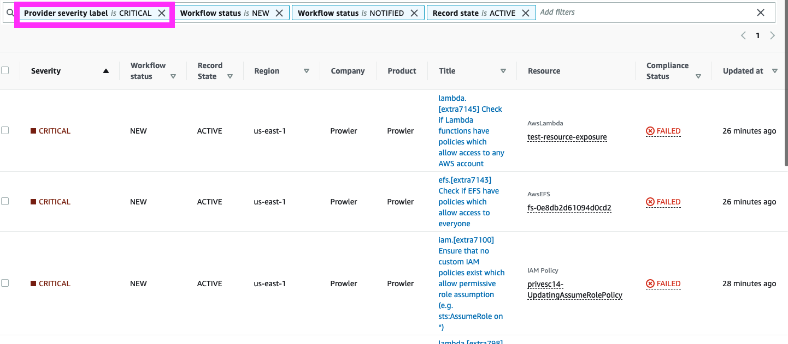

# Prowler single-account Fargate setup

This contains Terraform that:
* Deploys a CloudFormation stack that deploys the resources necessary for Prowler to run on a weekly basis using CodeBuild
* Sets up AWS Security hub in the account
* Runs the initial Prowler scan

# Instructions

From the main directory, create the infrastructure:

```bash
cd prowler-setup
# Set your AWS profile and region
export AWS_DEFAULT_PROFILE="vulnerable-aws"
export AWS_PROFILE="vulnerable-aws"
export AWS_DEFAULT_REGION="us-east-1"
# Initialize the Terraform and create the infrastructure
terraform init
terraform get
terraform plan
terraform apply -auto-approve
```

Now navigate to [CodeBuild Projects](https://console.aws.amazon.com/codesuite/codebuild/projects?region=us-east-1). You'll notice that the CodeBuild project says "In Progress."


Once it finishes, we can see that it failed:


That is not because the scan failed to complete, but because Prowler found security issues, as you can see from the line below that says, `Phase context status code: COMMAND_EXECUTION_ERROR Message: Error while executing command: ./prowler $PROWLER_OPTIONS. Reason: exit status 3`.


Now navigate to [Security Hub](https://console.aws.amazon.com/securityhub/home?region=us-east-1#/findings). We can see that there are a lot of findings with many severity levels. But since our hypothetical environment has lots of issues, let's filter for the critical ones first. In the search bar, type "Severity label is CRITICAL", as shown below.


You will see that the resulting table shows only critical findings only.




## Cleanup

Run the following command to destroy the infrastructure:

```bash
cd prowler-setup
# Set your AWS profile and region
export AWS_DEFAULT_PROFILE="vulnerable-aws"
export AWS_PROFILE="vulnerable-aws"
export AWS_DEFAULT_REGION="us-east-1"
# Destroy stuff
terraform destroy -auto-approve
```

# Future enhancements

Here is some food for thought about additional enhancements you might want to make.

* Set up a weekly security hub email. [Blog post from AWS on this topic](https://aws.amazon.com/blogs/security/how-to-set-up-a-recurring-security-hub-summary-email/). There is also sample code [here](https://github.com/aws-samples/aws-security-hub-summary-email)
* Create alerts for whenever there is a new critical finding
* Create alerts for whenever there is a new high finding
* Create QuickSight dashboard for overall findings
